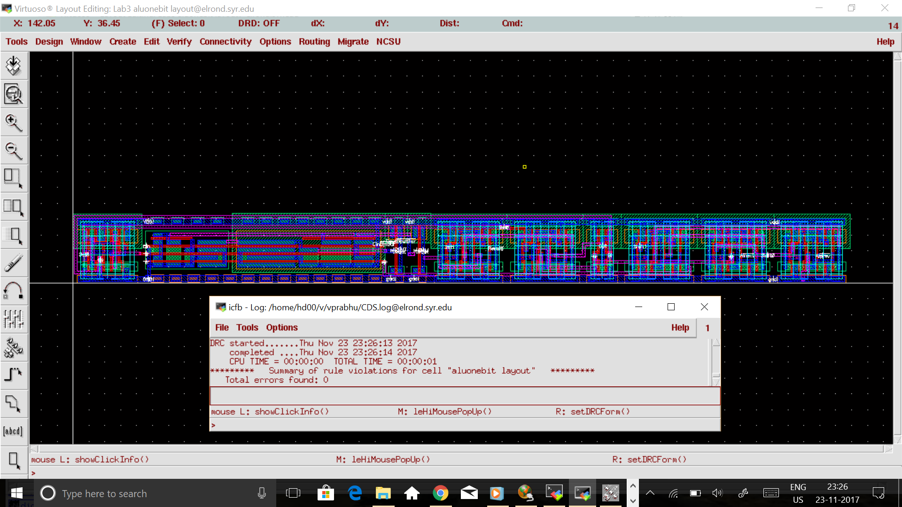
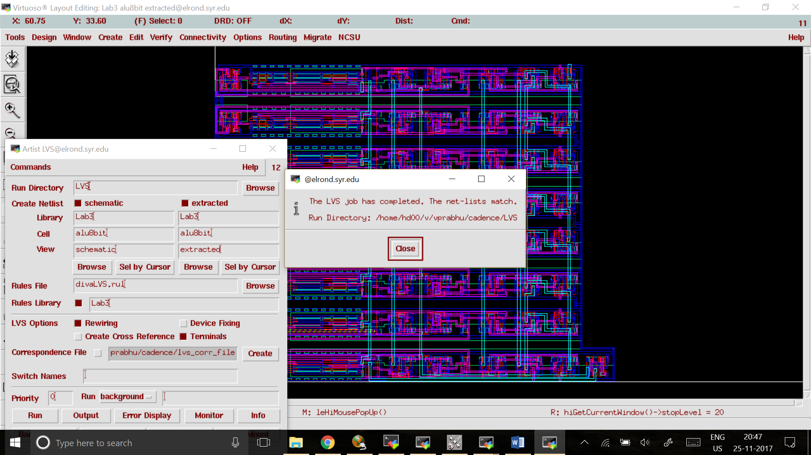

# 8-Bit-Microprocessor

This project required us to design the system using several components designed during the pre-lab sessions.
This included design of:
1. Inverter
2. NAND gate
3. Full adder
4. 1-Bit ALU
5. 8-Bit ALU
6. Controller
7. CPU 
8. PAD frame CPU for fabrication
---
### Inverter
We first sketched the schematic of the inverter. We were then provided with the size requirements for the design. The layout was then
prepared according to those dimensions. Both DRC and LVS was verified.  

---

### NAND gate
We first sketched the schematic of the NAND. We were then provided with the size requirements for the design. This also included the use 
of Inverter from previous lab. The layout was then
prepared according to those dimensions. Both DRC and LVS was verified.

----

### Full adder
We first sketched the schematic of the full adder. The design required the use of inverter design from previous lab. The layout was then prepared according to the previously provided dimensions. Both DRC and LVS was verified.

---

### 1-Bit ALU
We first sketched the schematic of the 1-bit ALU. The design required the use of designs from previous labs. The layout was then prepared according to the previously provided dimensions. Both DRC and LVS was verified.

---

### 8-Bit ALU
We first sketched the schematic of the 8-bit ALU using 8 1-bit ALU done in the previous lab. The layout was then prepared according to the previously provided dimensions. Both DRC and LVS was verified.

----

## Controller
We had to design a schematic for the control unit of the processor based on the requirement. We then had to place the components designed in the previous labs and route them to get a complete design. 

## CPU
The CPU design required us to basically place and route all the designs of previous labs. Metal 3 was mainly used for connections.

